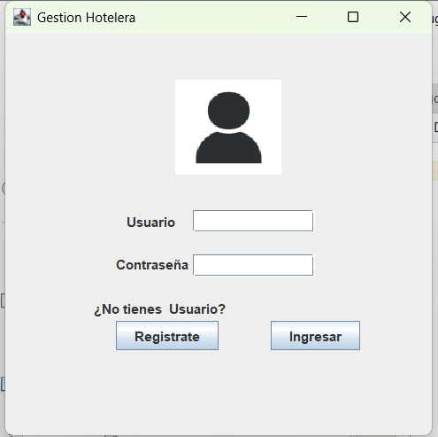
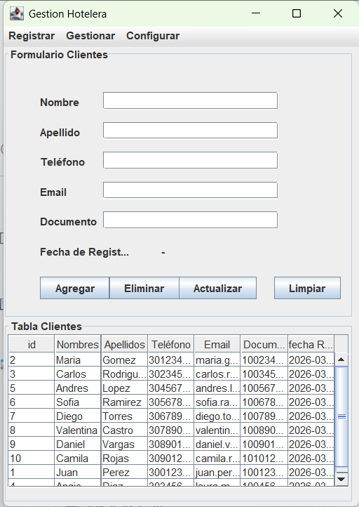
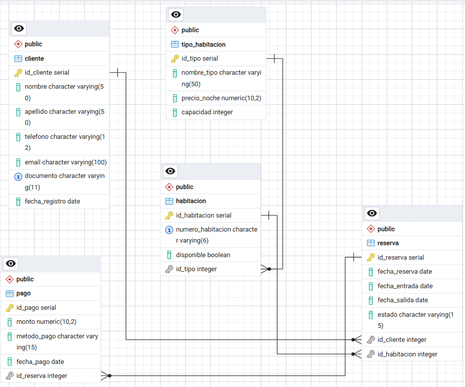

# gestion_hotelera
Sistema de Gestión Hotelera desarrollado en Java Swing y PostgreSQL para el Taller de Panel Administrativo (Iii Semestre 2026). Incluye CRUD de Clientes y navegación modular.
# **Gestión Hotelera**

### **Proyecto del Taller de Panel Administrativo**

**Tecnología de Desarrollo de Sistemas Informáticos**
---

#### **III Semestre 2026**

**Profesor**: Mag. Carlos Adolfo Beltrán Castro

**Estudiantes**: 

* Deyby Daniel Ruiz Díaz - 1005332975.
* Michael Steven Ruiz Díaz - 1016595938.

&#x09;	

**Descripción del Proyecto**
Este sistema de **Gestión Hotelera** es una aplicación de escritorio robusta desarrollada en **Java SE - SWING**. El proyecto centraliza la administración de un hotel, permitiendo el flujo completo desde el acceso al panel, la navegación por módulos específicos y la gestión persistente de datos en una base de datos relacional.

**Funcionalidades Implementadas:**

---

* **Conexión a Base de Datos:** Integración completa con **PostgreSQL 18.3** mediante el driver JDBC.
* **Gestión del Menú:** Sistema de navegación avanzado mediante **JMenuBar** y **JMenuItem**, organizado por procesos (Registrar, Gestionar, Configurar).
* **CRUD de Clientes:** Funcionalidad operativa para la creación, consulta, actualización y eliminación de registros de huéspedes.
* **Módulo de Cierre:** Función de salida en el menú Configurar que incluye un mensaje informativo de cierre de sesión mediante un cuadro de diálogo de confirmación.

#### **Estructura del Proyecto**

**Navegación por Módulos:**
---

La interfaz permite desplazarse entre las diferentes vistas del sistema:

* **Menú Registrar:** Acceso a los formularios de **Cliente** y **Habitación**.
* **Menú Gestionar:** Administración de **Pagos** y **Reservas**.
* **Menú Configurar:** Gestión de **Tipos de Habitación** y opción de **Cerrar Sesión**.

###### **Componentes Técnicos (Modelo-Vista-Controlador):**

* **DAO:** Clases ClientesDAO y PagosDAO para la lógica de datos.
* **modelo:** Entidades que representan el DER (Cliente, Habitación, Pago, Reserva, TipoHabitación).
* **vista:** Interfaces gráficas (AppCliente, AppLogin, AppPago).
* **conexion:** Gestión del enlace a PostgreSQL (Conexion\_db.java).

##### **Tecnologías Usadas**

* **Lenguaje:** Java (JDK 25).
* **Base de Datos:** PostgreSQL 18.3.
* **Librerías:** postgresql-42.7.11.jar, Absolute Layout.
* **Herramientas de Gestión:** pgAdmin 4 (ERD Tool y Query Tool).

##### **Instalación y Ejecución**

* **Base de Datos:** Crear la BD hotel\_db en PostgreSQL y ejecutar el script SQL adjunto en la **carpeta db** (generado desde pgAdmin).
* **Librerías:** Verificar que el JAR del driver de PostgreSQL esté en el classpath del proyecto.
* **Ejecución:** Iniciar desde Gestion\_hotelera.java. Al aparecer el Login, **presionar "Ingresar"** para habilitar el Panel Administrativo.
* **Uso:** Navegar a **Registrar > Cliente** para probar el CRUD funcionando con la base de datos.

##### **Entregables Adjuntos**

* **Script SQL:** script\_hotel\_db.sql (Incluye tablas, llaves primarias, foráneas y restricciones de integridad).
* **Diagrama ER:** Imagen del modelo relacional exportada desde pgAdmin.
* **Código Fuente:** Proyecto completo con la estructura de paquetes organizada.

