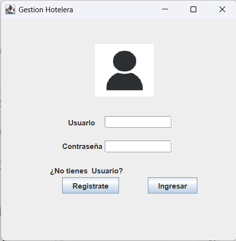
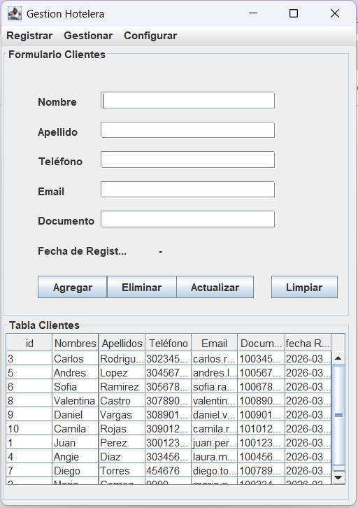
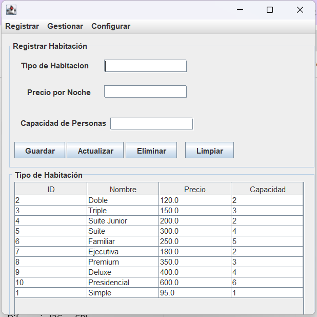
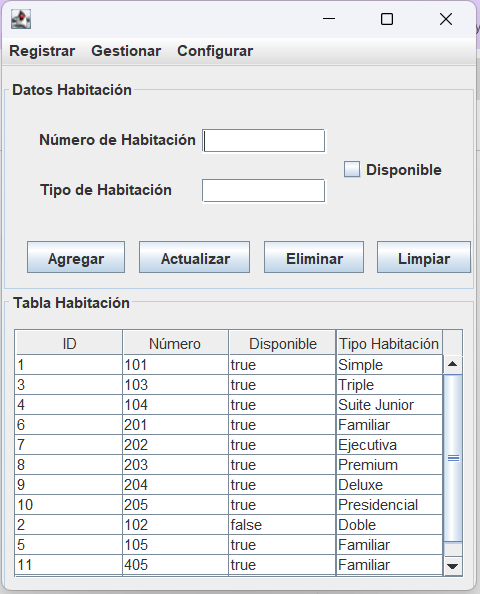
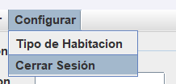
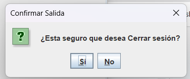
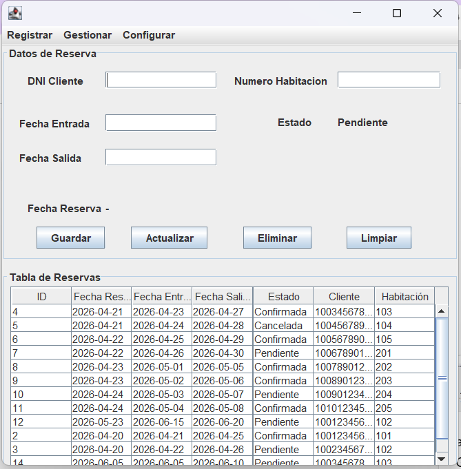
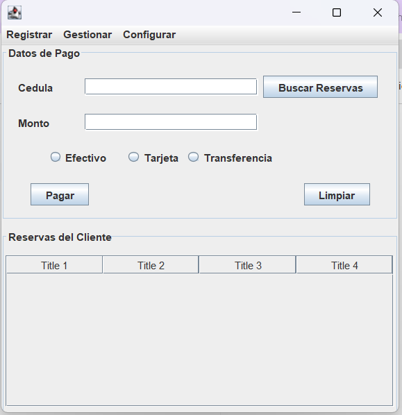
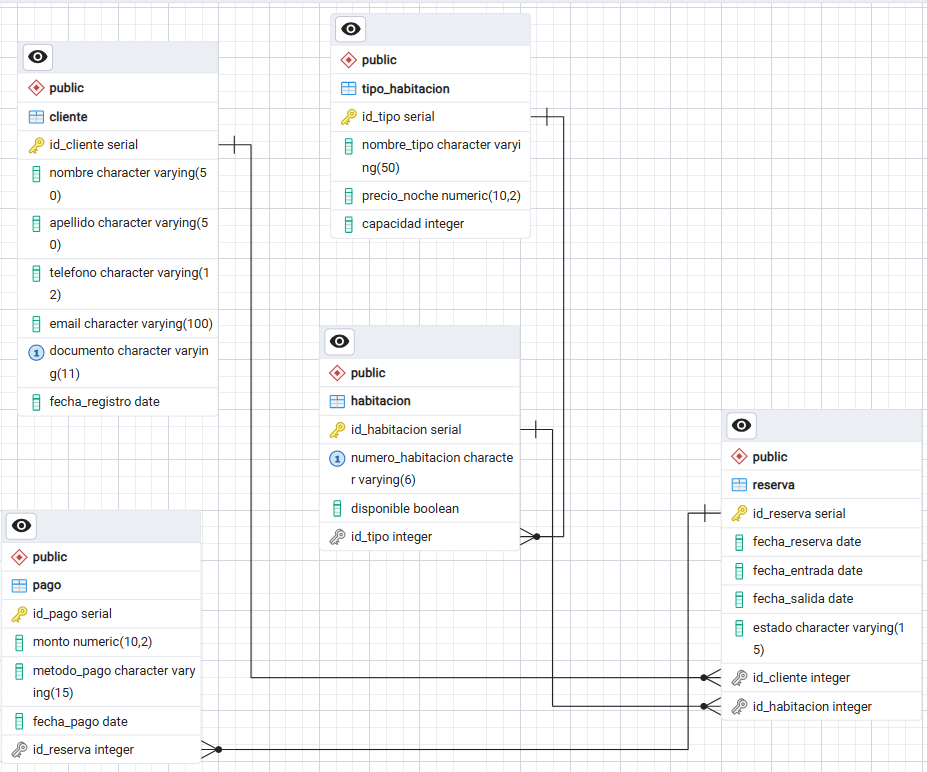

# gestion_hotelera

# **Gestión Hotelera**

### **Proyecto del Taller de Panel Administrativo**

**Tecnología de Desarrollo de Sistemas Informáticos**

---

#### **III Semestre 2026**

**Profesor**: Mag. Carlos Adolfo Beltrán Castro

**Estudiantes**: 
* Deyby Daniel Ruiz Díaz - 1005332975
* Michael Steven Ruiz Díaz - 1016595938

---

# Sistema de Gestión Hotelera

Sistema de escritorio robusto y modular desarrollado en Java Swing y PostgreSQL para la administración integral de establecimientos hoteleros. La aplicación permite centralizar el control de clientes, optimizar la asignación de habitaciones, gestionar los flujos de reservas y auditar los pagos correspondientes desde una interfaz gráfica intuitiva y persistencia de datos segura.

El objetivo principal de este proyecto es proveer una solución tecnológica escalable que minimice los errores operativos en la recepción, automatice los procesos administrativos cotidianos y facilite la toma de decisiones mediante consultas estructuradas en tiempo real.

---

# Características Generales del Proyecto

El sistema está diseñado bajo una arquitectura limpia y modular que cubre las necesidades operativas más críticas de un entorno hotelero:

- **Arquitectura de Navegación Modular**: Menús organizados jerárquicamente para transiciones fluidas entre pantallas.
- **Operaciones CRUD Completas**: Gestión automatizada de registros (Creación, Lectura, Actualización y Eliminación).
- **Consistencia y Reglas de Negocio**: Validación rigurosa de formularios antes de la persistencia de datos.
- **Control Operativo**: Seguimiento en tiempo real de la disponibilidad de las habitaciones por categorías y el estado financiero de cada reserva.
- **Interfaz Intuitiva**: Diseño visual enfocado en la usabilidad y la eficiencia del usuario final.

---

# Módulo de Inicio de Sesión

Este módulo actúa como la primera línea de seguridad del sistema, controlando el acceso mediante la autenticación formal de credenciales de usuario.

## Funcionalidades

- Inicio de sesión seguro mediante usuario y contraseña validados en la base de datos.
- Restricción estricta de accesos a la interfaz administrativa central para usuarios no autorizados.
- Opción modular para el registro e incorporación de nuevos usuarios al sistema.
- Formulario limpio con controles visuales básicos de acceso.

## Vista del módulo

### Descripción

Al iniciar la aplicación, se despliega la ventana de autenticación. Si el operador no posee credenciales vigentes, el sistema permite la redirección al formulario de "Regístrate" para crear un nuevo usuario y registrarlo en la persistencia del sistema.

---

# Módulo de Gestión de Clientes

Permite la administración y el seguimiento detallado de toda la información histórica y operativa relacionada con los huéspedes del hotel.

## Funcionalidades

- **Registro**: Alta de nuevos huéspedes con validación de campos obligatorios.
- **Consulta**: Listado dinámico y búsqueda de clientes existentes a través de la interfaz.
- **Actualización**: Modificación en caliente de datos demográficos o de contacto del cliente.
- **Eliminación**: Baja lógica o física de registros del sistema.
- **Optimización**: Limpieza rápida de componentes de texto mediante un solo comando para agilizar la captura de nuevos datos.

## Información almacenada

Para cada huésped se auditan los siguientes campos en el motor relacional:

- Nombre.
- Apellido.
- Número telefónico.
- Correo electrónico.
- Documento de identidad (Llave primaria/Alterna de búsqueda).
- Fecha automatizada de registro.

## Vista del módulo

### Descripción

La información se consolida en un componente de tabla tabular, lo que permite al administrador buscar, seleccionar y modificar registros de forma ágil, garantizando que el directorio de huéspedes permanezca limpio, íntegro y actualizado.

---

# Módulo de Gestión de Habitaciones

Este módulo provee los mecanismos necesarios para la administración física e inventario de las habitaciones disponibles dentro del establecimiento.

## Funcionalidades

- Registro y mapeo de unidades habitacionales.
- Modificación de características operativas de las habitaciones.
- Eliminación y depuración de registros obsoletos.
- Consulta centralizada del listado maestro de inventario.

## Información administrada

- Número de habitación.
- Tipo de habitación (Categoría vinculada).
- Estado actual de disponibilidad (Libre, Ocupada, Mantenimiento).

## Sub-módulo: Configuración de Tipos de Habitaciones

Permite la parametrización de las diferentes categorías de hospedaje que ofrece el hotel, definiendo de manera centralizada las tarifas base por noche y la densidad de ocupación permitida.

### Vista del sub-módulo

### Tipos de habitaciones configuradas

- Simple.
- Doble.
- Triple.
- Suite Junior.
- Suite.
- Familiar.
- Ejecutiva.
- Premium.
- Deluxe.
- Presidencial.

## Vista del módulo principal

### Descripción

El sistema permite cruzar el inventario de habitaciones con sus categorías parametrizadas. Esto facilita al personal de recepción identificar instantáneamente qué habitaciones se acomodan a las necesidades del cliente y calcular costos de forma automatizada durante el proceso de reserva.

---

# Barra de Menús y Control de Sesión

La aplicación implementa una barra de herramientas superior estructurada (Registrar, Gestionar, Configurar) que funciona como el núcleo de la navegación modular del software.

## Menú Configurar

A través de este menú desplegable, el usuario puede acceder directamente a los formularios de parametrización del sistema (como los Tipos de Habitación) o gestionar el flujo de cierre del entorno de trabajo.

## Confirmación de Salida

Como mecanismo de seguridad contra la pérdida de datos o cierres accidentales, la opción "Cerrar Sesión" interrumpe el flujo principal y lanza un cuadro de diálogo modal de confirmación.

---

# Módulo de Reservas

Este módulo controla el ciclo de vida del hospedaje, vinculando directamente a los clientes con las habitaciones disponibles en rangos de fechas específicos.

## Funcionalidades

- Apertura y registro de nuevas reservas asignando habitaciones libres.
- Reprogramación y actualización de fechas o estados de la reserva.
- Cancelación y eliminación de registros de la agenda.
- Consulta dinámica del histórico y estados de ocupación de las habitaciones.

## Información registrada

- Documento de identidad del cliente (Clave foránea).
- Número de habitación asignada (Clave foránea).
- Fecha de entrada (Check-In).
- Fecha de salida (Check-Out).
- Fecha de creación de la reserva.
- Estado operativo de la reserva.

## Estados de reserva admitidos

- **Confirmada**: Reserva activa con habitación bloqueada.
- **Pendiente**: En espera de verificación o pago inicial.
- **Cancelada**: Liberación automática de la habitación asignada.

## Vista del módulo

### Descripción

El módulo mitiga problemas críticos como la sobreventa de habitaciones (overbooking) mediante un riguroso control de fechas, permitiendo monitorizar el estado de cada habitación desde que se solicita el ingreso hasta que el huésped abandona el hotel.

---

# Módulo de Pagos

Garantiza el control financiero de las transacciones procesadas por concepto de hospedaje y servicios dentro de la aplicación.

## Funcionalidades

- Búsqueda selectiva de reservas activas e históricas de un cliente mediante su documento.
- Registro detallado de transacciones financieras y abonos.
- Limpieza automática de formularios de pago para nuevas operaciones.
- Visualización histórica de saldos y cuentas relacionadas por huésped.

## Información administrada

- Documento de identidad del cliente.
- Valor del pago (Monto total o parcial).
- Método de pago seleccionado.

## Métodos de pago disponibles

- Efectivo.
- Tarjeta de Crédito / Débito.
- Transferencia bancaria.

## Vista del módulo

### Descripción

Este componente unifica la gestión operativa con la financiera, enlazando cada pago directamente a una reserva validada, lo que simplifica la auditoría interna de caja y asegura la transparencia en los cobros.

---

# Diseño y Arquitectura de la Base de Datos

La persistencia del sistema se fundamenta en un modelo relacional estructurado que garantiza la integridad referencial, consistencia de datos y evita la redundancia mediante una correcta normalización.

## Modelo Entidad-Relación

El diseño de las tablas, sus restricciones de llaves primarias, foráneas y las relaciones lógicas del negocio se representan en el siguiente diagrama:

### Descripción del Esquema Relacional

- **cliente**: Almacena los datos maestros de los huéspedes. Su identificador principal mapea directamente las transacciones operativas.
- **tipo_habitacion**: Tabla de parametrización que centraliza los precios y capacidades para evitar inconsistencias en las tarifas.
- **habitacion**: Contiene las unidades físicas del hotel, enlazadas jerárquicamente a un tipo de habitación específico mediante claves foráneas.
- **reserva**: Entidad pivot crucial que formaliza la relación de muchos a muchos entre clientes y habitaciones en un periodo de tiempo determinado.
- **pago**: Entidad dependiente de las reservas que audita el flujo monetario y los métodos de liquidación elegidos por el usuario.

---

# Tecnologías Utilizadas

El sistema se construyó bajo estándares de desarrollo de software formal para aplicaciones de escritorio:

## Backend y Lógica de Negocio

- **Java (JDK 17+)**: Uso intensivo de Programación Orientada a Objetos (POO), patrones de diseño y modularidad.
- **Colecciones y DTOs**: Estructuras limpias para el intercambio de datos entre capas.

## Interfaz Gráfica (Frontend)

- **Java Swing**: Ventanas, contenedores, layouts y componentes avanzados de la biblioteca estándar de UI.
- **Manejo de Eventos**: ActionListeners y listeners personalizados para una UI reactiva.

## Persistencia de Datos

- **PostgreSQL**: Motor de base de datos relacional para garantizar la integridad y concurrencia de la información.
- **JDBC (Java Database Connectivity)**: Controladores y consultas preparadas (PreparedStatements) para una comunicación segura y libre de inyecciones SQL.

---

# Estructura General del Sistema

El flujo lógico estándar de la aplicación comprende los siguientes pasos:

1. **Autenticación**: El usuario administrador inicia sesión de forma segura.
2. **Altas**: Registro de clientes y configuración base de tipos de habitación e inventario.
3. **Operación**: Selección de clientes y habitaciones disponibles para generar transacciones de Reserva.
4. **Cierre Financiero**: Registro de los métodos de pago y liquidación de las reservas correspondientes.
5. **Mantenimiento**: Actualización o depuración constante de los datos mediante operaciones CRUD.

---

# Posibles Mejoras Futuras

Para la evolución tecnológica del sistema, se contemplan las siguientes características:

- Generación automatizada de facturas y recibos en formato PDF.
- Reportes estadísticos y gráficos de ocupación financiera mensual.
- Dashboard administrativo con métricas clave (KPIs) en la pantalla principal.
- Módulo de control de empleados, turnos y nómina básica.
- Control de roles de usuario y permisos granulares (Recepcionista, Administrador, Auditor).
- Exportación nativa de reportes a hojas de cálculo de Excel.
- Notificaciones automáticas de confirmación vía correo electrónico a los huéspedes.

---

# Autoría

Proyecto académico de desarrollo de software diseñado como una solución integral para la gestión hotelera, aplicando conceptos avanzados de programación orientada a objetos, arquitectura de software por capas, bases de datos relacionales y diseño de interfaces gráficas de usuario en Java.